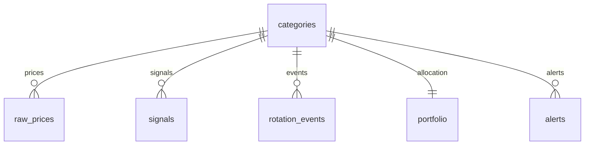
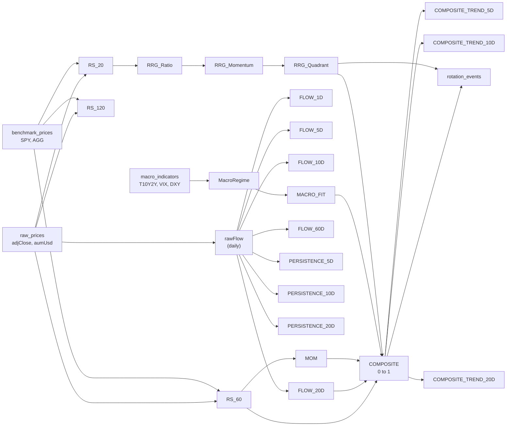

# Spec — Follow the Money

Single authoritative specification. Covers stack, data model, signal formulas, and API contract.
**How to update:** Check `DECISIONS.md` first. Update this file after any decision changes.

<!-- affects: DECISIONS, roadmap -->

---

## Technology stack

| Layer | Technology | Notes |
|-------|-----------|-------|
| Backend language | Java 21 (LTS) | Spring Boot 4 / Spring Framework 7 |
| Backend service | `ftm-app` — single Spring Boot 4 monolith | See D-007 |
| REST API | Spring MVC | OpenAPI via springdoc-openapi |
| Database | PostgreSQL 16 | Window functions for signal computation (D-001) |
| DB migrations | Flyway | `ftm-app` owns all migrations |
| ORM / data access | Spring Data JPA + JDBC Template | JPA for entities, JDBC for bulk signal inserts |
| Internal pipeline events | Spring `ApplicationEventPublisher` + `@Async` | Replaces RabbitMQ (D-002) |
| Scheduler | Spring `@Scheduled` | Triggers daily ingestion |
| Cache | Caffeine (Spring Boot in-process) | Replaces Redis (D-005) |
| AI layer | Spring AI (opt-in) | Signal explanations, portfolio advice (D-006) |
| Frontend | Next.js 15 (App Router) | React 19, SSR, TypeScript |
| Charting | TradingView Lightweight Charts + Recharts | Price/RRG + bar/flow |
| External data | Yahoo Finance REST API + FRED REST API | Direct HTTP via Spring `WebClient` |
| Package manager | Maven (Java) · pnpm (Node) | |

**Docker Compose:** PostgreSQL only.

**Running processes:**
- `ftm-app` — Spring Boot monolith on `:8080`
- `ftm-frontend` — Next.js on `:3000`

---

## Repository layout

```
follow-the-money/
├── CLAUDE.md                         ← "Read context/INDEX.md"
├── context/                          ← all AI context lives here
├── docker-compose.yml                ← PostgreSQL 16 only
│
├── ftm-app/                          ← single Spring Boot 4 monolith
│   ├── pom.xml
│   └── src/main/java/com/ftm/app/
│       ├── FtmApplication.java
│       ├── ingestion/                ← YahooFinanceClient, FredClient, IngestionService
│       │   └── events/               ← IngestionRequestedEvent, IngestionCompleteEvent
│       ├── signals/                  ← RelativeStrengthService, MomentumService, FlowService
│       │   └── events/               ← SignalsUpdatedEvent
│       ├── alerts/                   ← AlertRulesEngine, AlertService
│       ├── portfolio/                ← PortfolioService, AlignmentService
│       ├── api/                      ← REST controllers (Spring MVC)
│       │   └── controller/           ← CategoryController, SignalController, etc.
│       ├── ai/                       ← ExplanationService, AdviceService (opt-in)
│       └── domain/                   ← JPA entities
│   └── src/main/resources/
│       ├── application.yml
│       └── db/migration/             ← V1__initial_schema.sql, V2__seed_categories.sql …
│
└── ftm-frontend/                     ← Next.js 15
    ├── package.json
    └── src/
        ├── app/                      ← App Router pages
        ├── components/               ← charts, panels, tables
        └── lib/api.ts                ← typed API client (generated from OpenAPI spec)
```

---

## Event-driven ingestion pipeline (Spring events)

```
@Scheduled(cron="0 30 16 * * MON-FRI", zone="America/New_York")
  OR  POST /api/v1/ingest/trigger
    → publishes IngestionRequestedEvent

@EventListener @Async → IngestionService
  → fetches Yahoo Finance (19 ETFs + SPY + AGG)
  → fetches FRED (7 macro series)
  → writes raw_prices, macro_indicators
  → publishes IngestionCompleteEvent

@EventListener @Async → SignalService
  → computes RS, MOM, FLOW family, RRG, MACRO_FIT, COMPOSITE
  → writes signals
  → evicts Caffeine cache
  → publishes SignalsUpdatedEvent

@EventListener @Async → AlertService
  → evaluates alert rules
  → writes alerts
```

Error handling: log failures to `ingest_log`. Re-trigger via `POST /api/v1/ingest/trigger`.

---

## Investable universe (19 categories)

<!-- affects: DECISIONS -->

| id | Name | Type | ETF | Benchmark |
|----|------|------|-----|-----------|
| TECH | Information Technology | EQUITY_SECTOR | XLK | SPY |
| HLTH | Health Care | EQUITY_SECTOR | XLV | SPY |
| FINL | Financials | EQUITY_SECTOR | XLF | SPY |
| DISR | Consumer Discretionary | EQUITY_SECTOR | XLY | SPY |
| INDU | Industrials | EQUITY_SECTOR | XLI | SPY |
| ENRG | Energy | EQUITY_SECTOR | XLE | SPY |
| MATL | Materials | EQUITY_SECTOR | XLB | SPY |
| UTIL | Utilities | EQUITY_SECTOR | XLU | SPY |
| REIT | Real Estate | EQUITY_SECTOR | XLRE | SPY |
| STPL | Consumer Staples | EQUITY_SECTOR | XLP | SPY |
| COMM | Communication Services | EQUITY_SECTOR | XLC | SPY |
| GOLD | Gold | PRECIOUS_METAL | GLD | SPY |
| SLVR | Silver | PRECIOUS_METAL | SLV | SPY |
| GDMN | Gold Miners | PRECIOUS_METAL | GDX | SPY |
| TLTD | Long-Duration Treasuries | FIXED_INCOME | TLT | AGG |
| TINT | Intermediate Treasuries | FIXED_INCOME | IEF | AGG |
| CORP | Investment Grade Corporate | FIXED_INCOME | LQD | AGG |
| HIYLD | High Yield | FIXED_INCOME | HYG | AGG |
| CASH | Cash & Short-Term | CASH | BIL | SPY |

---

## Data model

### Entity-relationship diagram



### `categories`

```sql
CREATE TABLE categories (
    id               VARCHAR(10)  PRIMARY KEY,
    name             VARCHAR(100) NOT NULL,
    type             VARCHAR(20)  NOT NULL CHECK (type IN ('EQUITY_SECTOR','PRECIOUS_METAL','FIXED_INCOME','CASH')),
    etf_ticker       VARCHAR(10)  NOT NULL,
    benchmark_ticker VARCHAR(10)  NOT NULL,
    display_order    INTEGER      NOT NULL,
    active           BOOLEAN      NOT NULL DEFAULT TRUE
);
```

### `raw_prices`

```sql
CREATE TABLE raw_prices (
    trade_date       DATE          NOT NULL,
    category_id      VARCHAR(10)   NOT NULL REFERENCES categories(id),
    open             NUMERIC(12,4) NOT NULL,
    high             NUMERIC(12,4) NOT NULL,
    low              NUMERIC(12,4) NOT NULL,
    close            NUMERIC(12,4) NOT NULL,
    adj_close        NUMERIC(12,4) NOT NULL,   -- use this for all return calculations
    volume           BIGINT        NOT NULL,
    aum_usd          NUMERIC(18,2),             -- nullable; not all ETFs expose AUM
    estimated_flow   NUMERIC(18,2),             -- AUM delta minus price-driven change (D-003)
    PRIMARY KEY (trade_date, category_id)
);

CREATE INDEX idx_raw_prices_category_date ON raw_prices (category_id, trade_date DESC);
```

### `benchmark_prices`

```sql
CREATE TABLE benchmark_prices (
    trade_date  DATE          NOT NULL,
    ticker      VARCHAR(10)   NOT NULL,
    adj_close   NUMERIC(12,4) NOT NULL,
    PRIMARY KEY (trade_date, ticker)
);
```

### `macro_indicators`

```sql
CREATE TABLE macro_indicators (
    observation_date DATE        NOT NULL,
    series_id        VARCHAR(20) NOT NULL,
    value            NUMERIC(10,4),
    source           VARCHAR(10) NOT NULL DEFAULT 'FRED',
    PRIMARY KEY (observation_date, series_id)
);
```

FRED series tracked: `T10Y2Y`, `T10YIE`, `VIXCLS`, `DTWEXBGS`, `FEDFUNDS`, `DGS10`, `DGS2`

### `signals`

```sql
CREATE TABLE signals (
    signal_date  DATE          NOT NULL,
    category_id  VARCHAR(10)   NOT NULL REFERENCES categories(id),
    signal_type  VARCHAR(30)   NOT NULL,
    value        NUMERIC(10,6),
    metadata     JSONB,
    computed_at  TIMESTAMPTZ   NOT NULL DEFAULT NOW(),
    PRIMARY KEY (signal_date, category_id, signal_type)
);

-- signal_type values:
--   RS_20, RS_60, RS_120
--   MOM
--   FLOW_1D, FLOW_5D, FLOW_10D, FLOW_20D, FLOW_60D
--   PERSISTENCE_5D, PERSISTENCE_10D, PERSISTENCE_20D
--   RRG_RATIO, RRG_MOM, RRG_QUADRANT
--   MACRO_REGIME, MACRO_FIT
--   COMPOSITE, COMPOSITE_TREND_5D, COMPOSITE_TREND_10D, COMPOSITE_TREND_20D

CREATE INDEX idx_signals_category_date ON signals (category_id, signal_date DESC);
CREATE INDEX idx_signals_type_date     ON signals (signal_type, signal_date DESC);
```

### `rotation_events`

```sql
CREATE TABLE rotation_events (
    id               BIGSERIAL    PRIMARY KEY,
    detected_date    DATE         NOT NULL,
    category_id      VARCHAR(10)  NOT NULL REFERENCES categories(id),
    event_type       VARCHAR(30)  NOT NULL CHECK (event_type IN ('ENTERING_IMPROVING','ENTERING_LEADING','FLOW_SURGE','COMPOSITE_BREAKOUT')),
    confidence       NUMERIC(4,3) NOT NULL CHECK (confidence BETWEEN 0 AND 1),
    signal_snapshot  JSONB        NOT NULL,
    notes            TEXT
);

CREATE INDEX idx_rotation_events_date ON rotation_events (detected_date DESC);
```

### `portfolio`

```sql
CREATE TABLE portfolio (
    category_id    VARCHAR(10)   PRIMARY KEY REFERENCES categories(id),
    allocation_pct NUMERIC(5,2)  NOT NULL CHECK (allocation_pct >= 0),
    last_updated   TIMESTAMPTZ   NOT NULL DEFAULT NOW(),
    notes          TEXT
);
-- Application must enforce: SUM(allocation_pct) = 100.00
```

### `alert_rules`

```sql
CREATE TABLE alert_rules (
    rule_id             VARCHAR(40) PRIMARY KEY,
    enabled             BOOLEAN     NOT NULL DEFAULT TRUE,
    z_threshold         NUMERIC(4,2),
    persistence_days    INTEGER,
    composite_threshold NUMERIC(4,3),
    severity            VARCHAR(10) NOT NULL CHECK (severity IN ('INFO','WARNING','ACTION')),
    category_filter     JSONB,
    config              JSONB,
    last_updated        TIMESTAMPTZ NOT NULL DEFAULT NOW()
);
```

### `alerts`

```sql
CREATE TABLE alerts (
    id               BIGSERIAL    PRIMARY KEY,
    created_at       TIMESTAMPTZ  NOT NULL DEFAULT NOW(),
    category_id      VARCHAR(10)  REFERENCES categories(id),
    rule_id          VARCHAR(40)  NOT NULL REFERENCES alert_rules(rule_id),
    severity         VARCHAR(10)  NOT NULL CHECK (severity IN ('INFO','WARNING','ACTION')),
    message          TEXT         NOT NULL,
    trigger_snapshot JSONB        NOT NULL,
    status           VARCHAR(10)  NOT NULL DEFAULT 'ACTIVE'
                                  CHECK (status IN ('ACTIVE','RESOLVED','ACKNOWLEDGED')),
    resolved_at      TIMESTAMPTZ,
    acknowledged_at  TIMESTAMPTZ,
    UNIQUE (category_id, rule_id, status)
);

CREATE INDEX idx_alerts_active   ON alerts (created_at DESC) WHERE status = 'ACTIVE';
CREATE INDEX idx_alerts_severity ON alerts (severity, created_at DESC) WHERE status = 'ACTIVE';
```

### `ingest_log`

```sql
CREATE TABLE ingest_log (
    run_id        UUID         PRIMARY KEY DEFAULT gen_random_uuid(),
    started_at    TIMESTAMPTZ  NOT NULL,
    finished_at   TIMESTAMPTZ,
    status        VARCHAR(10)  NOT NULL CHECK (status IN ('RUNNING','SUCCESS','PARTIAL','FAILED')),
    rows_inserted INTEGER      NOT NULL DEFAULT 0,
    errors        JSONB,
    source        VARCHAR(10)  NOT NULL CHECK (source IN ('PRICES','MACRO','FLOWS'))
);
```

### Data integrity rules

1. `adj_close` is the canonical price for all return calculations. Never use `close` for analytics.
2. `portfolio.allocation_pct` values across all rows must sum to exactly 100.0.
3. Dates are US trading calendar dates. Weekends and market holidays must not appear in `raw_prices` or `signals`.
4. `signals` rows are immutable once written. To correct a signal, insert a new row with updated `computed_at`.
5. `aum_usd` may be NULL. In that case, FLOW signals are NULL and excluded from COMPOSITE with weights redistributed.

---

## Signal formulas

### RS — Relative Strength
```
RS(category, date, N) = (adjClose[date] / adjClose[date-N]) / (benchmark[date] / benchmark[date-N]) - 1
```
Computed for N = 20, 60, 120 trading days. Benchmark from `categories.benchmark_ticker`.

### MOM — Momentum of Relative Strength
```
MOM(category, date) = RS_60(date) - RS_60(date - 10)
```

### rawFlow (daily, prerequisite)
```
rawFlow(date) = (AUM[date] - AUM[date-1]) - (priceReturn[date] × AUM[date-1])
```

### FLOW family — multi-timeframe trend signals

| Signal | Formula |
|--------|---------|
| FLOW_1D | z-score of rawFlow[date] over trailing 90 days |
| FLOW_5D | z-score of sum(rawFlow, last 5 days) over trailing 90 days of 5-day rolling sums |
| FLOW_10D | z-score of sum(rawFlow, last 10 days) over trailing 90 days of 10-day rolling sums |
| FLOW_20D | z-score of sum(rawFlow, last 20 days) over trailing 90 days of 20-day rolling sums |
| FLOW_60D | z-score of sum(rawFlow, last 60 days) over trailing 252 days of 60-day rolling sums |
| PERSISTENCE_5D | count of last 5 trading days where rawFlow > 0 |
| PERSISTENCE_10D | count of last 10 trading days where rawFlow > 0 |
| PERSISTENCE_20D | count of last 20 trading days where rawFlow > 0 |

z-score > +1.5 = strong inflow; < -1.5 = strong outflow.

### COMPOSITE_TREND family
```
COMPOSITE_TREND_5D  = COMPOSITE[date] - COMPOSITE[date - 5]
COMPOSITE_TREND_10D = COMPOSITE[date] - COMPOSITE[date - 10]
COMPOSITE_TREND_20D = COMPOSITE[date] - COMPOSITE[date - 20]
```

### RRG — Relative Rotation Graph
```
RS_Ratio(t)    = 100 + EMA(RS_20, 10) × 100
RS_Momentum(t) = 100 + (RS_Ratio(t) - EMA(RS_Ratio, 5)) × 20
```

Quadrant assignment:
- RS_Ratio > 100 AND RS_Momentum > 100 → **Leading**
- RS_Ratio > 100 AND RS_Momentum < 100 → **Weakening**
- RS_Ratio < 100 AND RS_Momentum < 100 → **Lagging**
- RS_Ratio < 100 AND RS_Momentum > 100 → **Improving**

### COMPOSITE (pending RFC-0002 confirmation)
```
COMPOSITE = 0.35 × norm(RS_60)
          + 0.25 × norm(FLOW_20D)
          + 0.20 × norm(MOM)
          + 0.10 × norm(MACRO_FIT)
          + 0.10 × rrgScore
```

`norm()` = min-max across all 19 categories on a given date.
`rrgScore`: Leading=1.0, Improving=0.7, Weakening=0.3, Lagging=0.0.
If a sub-signal is NULL, redistribute its weight proportionally across the non-NULL components.

---

## Signal computation graph



---

## REST API

**Base URL:** `http://127.0.0.1:8080/api/v1`
**Dates:** ISO-8601 (`YYYY-MM-DD`); timestamps UTC (`2026-05-14T20:45:00Z`)
**Auth:** None (loopback only — D-004)
**OpenAPI:** `http://127.0.0.1:8080/swagger-ui.html`
**CORS:** `http://localhost:3000` and `http://127.0.0.1:3000` only

### `GET /categories`

All 19 categories with latest composite score and RRG quadrant.

**Query params:** `timeframe` (default `MONTH`) — `DAY | WEEK | MONTH | QUARTER | YEAR`

```json
{
  "as_of_date": "2026-05-14",
  "timeframe": "MONTH",
  "categories": [
    {
      "id": "TECH",
      "name": "Information Technology",
      "type": "EQUITY_SECTOR",
      "etf_ticker": "XLK",
      "composite_score": 0.78,
      "composite_trend_20d": 0.04,
      "rrg_quadrant": "Leading",
      "rs_60": 0.12,
      "flow_20d": 1.8,
      "persistence_20d": 14,
      "rank": 1
    }
  ]
}
```

### `GET /rotation`

Current rotation matrix.

**Query params:** `timeframe` (default `MONTH`)

```json
{
  "as_of_date": "2026-05-14",
  "timeframe": "MONTH",
  "top_inflow":  ["TECH", "FINL", "INDU"],
  "top_outflow": ["UTIL", "TLTD", "CASH"],
  "rrg_transitions": [
    { "category_id": "ENRG", "from_quadrant": "Improving", "to_quadrant": "Leading", "days_ago": 3 }
  ],
  "matrix": {
    "TECH": { "flow_score": 1.8, "rs_60": 0.12, "composite": 0.78, "composite_trend_20d": 0.04 }
  }
}
```

### `GET /signals/{categoryId}`

Full multi-timeframe signal history for one category.

**Query params:** `from_date`, `to_date`, `signals` (comma-separated, optional filter)

```json
{
  "category_id": "TECH",
  "signals": [
    {
      "date": "2026-05-14",
      "RS_20": 0.05, "RS_60": 0.12, "RS_120": 0.18,
      "MOM": 0.03,
      "FLOW_1D": 1.2, "FLOW_5D": 1.6, "FLOW_10D": 1.7, "FLOW_20D": 1.8, "FLOW_60D": 1.4,
      "PERSISTENCE_5D": 4, "PERSISTENCE_10D": 7, "PERSISTENCE_20D": 14,
      "RRG_RATIO": 102.4, "RRG_MOM": 101.1, "RRG_QUADRANT": "Leading",
      "MACRO_FIT": 0.72,
      "COMPOSITE": 0.78, "COMPOSITE_TREND_5D": 0.02, "COMPOSITE_TREND_10D": 0.03, "COMPOSITE_TREND_20D": 0.04
    }
  ]
}
```

### `GET /portfolio`

```json
{
  "last_updated": "2026-05-13T18:00:00Z",
  "alignment_score": 0.64,
  "holdings": [
    { "category_id": "TECH", "allocation_pct": 35.0, "composite_score": 0.78, "alignment": "strong", "suggested_delta": "+5%" }
  ],
  "suggested_rebalance": [
    { "category_id": "UTIL", "action": "reduce",   "from_pct": 10.0, "to_pct": 5.0 },
    { "category_id": "ENRG", "action": "increase", "from_pct": 5.0,  "to_pct": 10.0 }
  ]
}
```

### `PUT /portfolio`

**Request:** all 19 categories with `allocation_pct`; sum must equal 100.0 (±0.01 tolerance).
**Error:** `422 Unprocessable Entity` if validation fails.

### `GET /alerts`

**Query params:** `severity`, `category_id`, `rule_id`, `include_resolved` (default false)

```json
{
  "alerts": [
    {
      "id": 42,
      "created_at": "2026-05-14T17:05:00Z",
      "category_id": "ENRG",
      "rule_id": "flow_inflow_20d",
      "severity": "ACTION",
      "status": "ACTIVE",
      "message": "Energy (XLE): FLOW_20D z-score +2.1, 14 of 20 days positive.",
      "trigger_snapshot": { "FLOW_20D": 2.1, "PERSISTENCE_20D": 14, "RRG_QUADRANT": "Leading", "COMPOSITE": 0.81 },
      "active_rules_for_category": ["flow_inflow_5d", "flow_inflow_10d", "flow_inflow_20d"]
    }
  ]
}
```

### `POST /alerts/{id}/acknowledge`
### `GET /alerts/rules`
### `PUT /alerts/rules/{ruleId}`
### `POST /alerts/rules/preset` — body: `{ "preset": "BALANCED" }` (ACTIVE_TRADER | BALANCED | PATIENT_CAPITAL)

### `GET /macro`

```json
{
  "as_of_date": "2026-05-14",
  "regime": "RISK_ON_GROWTH",
  "indicators": {
    "yield_spread_10y2y": 0.42, "vix": 16.8, "usd_index": 104.2,
    "breakeven_inflation": 2.31, "fed_funds_rate": 4.75,
    "ten_year_yield": 4.35, "two_year_yield": 3.93
  },
  "regime_history": [
    { "date": "2026-05-01", "regime": "RISK_ON_GROWTH" }
  ]
}
```

### `GET /ai/explain/{categoryId}` (opt-in — returns 204 if Spring AI not configured)

```json
{
  "category_id": "ENRG",
  "explanation": "Energy is in the Leading quadrant because RS_60 is +12% versus SPY…",
  "generated_at": "2026-05-14T17:08:00Z",
  "model": "claude-sonnet-4-6"
}
```

### `GET /ai/advice/portfolio` (opt-in — returns 204 if Spring AI not configured)

### `POST /ingest/trigger`

Publishes `IngestionRequestedEvent` internally. Returns:

```json
{ "run_id": "b3f8c2e4-...", "status": "queued", "message": "Ingestion started. Poll /ingest/status/{runId}." }
```

### `GET /ingest/status/{runId}`
### `GET /ingest/status/latest` — latest run per source (PRICES, MACRO, FLOWS)

### Error format (RFC 7807)

```json
{
  "type": "https://ftm.local/errors/validation",
  "title": "Portfolio allocation does not sum to 100",
  "status": 422,
  "detail": "Sum of allocation_pct is 98.5. Difference: -1.5",
  "instance": "/api/v1/portfolio"
}
```

---

## Caching strategy (Caffeine)

| Cache name | Content | TTL | Evicted when |
|-----------|---------|-----|-------------|
| `signals-latest` | Latest signal row per category | 1h | `SignalsUpdatedEvent` |
| `rotation-matrix` | Current rotation matrix | 1h | `SignalsUpdatedEvent` |
| `macro-latest` | Macro indicators + regime | 6h | `IngestionCompleteEvent` |

---

## Spring AI integration

| Service | Triggered by | Input | Returns |
|---------|-------------|-------|---------|
| `ExplanationService` | Signal card expand | Category signals snapshot | Plain-English signal explanation |
| `AdviceService` | Portfolio page load | Portfolio + composite scores | Rebalancing narrative |
| `RegimeAnalysisService` | Macro panel (optional) | Current FRED indicators | Narrative regime classification |

All AI calls are opt-in. If `spring.ai.anthropic.api-key` is not set: endpoints return `204 No Content` + `X-AI-Status: disabled`.

AI calls receive only signal metadata. Raw portfolio dollar values and holdings are never sent (enforced in `ExplanationService` prompt builder).

---

## Performance SLAs

| Operation | Target |
|-----------|--------|
| Full signal recompute (all 19 categories) | < 30 seconds |
| Dashboard initial load (Caffeine warm) | < 1 second |
| Dashboard initial load (Caffeine cold) | < 3 seconds |
| Full ingestion pipeline | < 5 minutes after market close |
| Backtest — 5-year period | < 60 seconds |
| PostgreSQL DB size — 7 years × 19 categories daily | < 500 MB |
